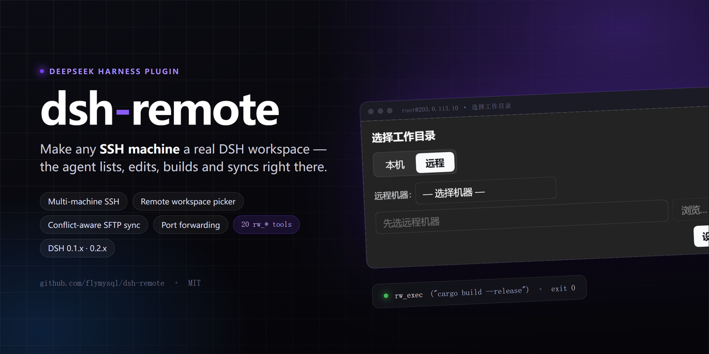
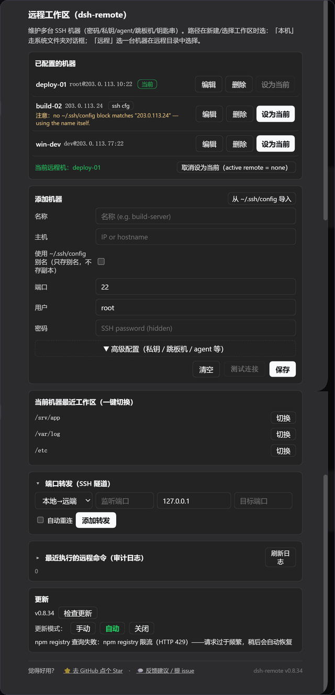
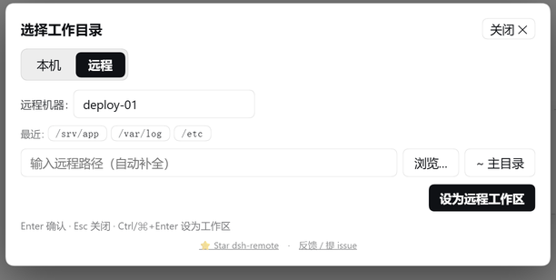

[English](./README.en.md) · **中文**

---

# dsh-remote

[](https://www.npmjs.com/package/dsh-remote)
[](https://www.npmjs.com/package/dsh-remote)
[](https://www.npmjs.com/package/dsh-remote)
[](LICENSE)
[](https://github.com/topics/dsh-plugin)

由 [@flymysql](https://github.com/flymysql) 维护 · [主页](https://flymysql.github.io/dsh-remote/) · [用量统计](https://flymysql.github.io/dsh-remote/stats/) · [博客](https://gitpull.cn) · [讨论区](https://github.com/flymysql/dsh-remote/discussions) · [Issue](https://github.com/flymysql/dsh-remote/issues) · [English](./README.en.md)



**为 [DeepSeek Harness](https://github.com/deepseek-ai/deepseek-harness)（DSH）打造的远程工作助手。**

维护多台 SSH 机器，然后在「选择工作区」时选一个**远程工作区**（或**本地工作区**），Agent 就能在不离开 harness 的情况下直接操作——列文件、读代码、在远程主机上跑构建/命令，并把远程目录镜像成一个真实的本地工作区对象。

DSH 的 Web 界面刻意只监听 `127.0.0.1`（CLI 为安全拒绝 `--host 0.0.0.0`）。本插件反过来：**由你主动连出**到你维护的机器，选一个工作区，然后通过 DSH 原生的工作区 + 文件流来工作——**不改动 `dsh-workspace` 核心**。

## 数据采集 / 遥测

每次启动发送一次匿名心跳（同一安装最少间隔 6 小时），只用于统计用量：**去重日活、实际在跑的版本、平台分布**。npm 下载量由发版驱动、且含镜像与爬虫，GitHub clone 混有 CI，都回答不了这些。

只发送 5 个字段：`idHash`（`HMAC-SHA256('dsh-remote/telemetry/v1', installId)` 的伪名）、`version`、`platform`、`arch`、`node`。**不发送**主机名、用户名、路径、IP、SSH 主机/端口/密钥、机器列表、会话内容。原始 `installId`（`<DSH_HOME>/.dsh-remote-install-id`）不离开本机，只传它的 HMAC。

心跳是尽力而为的旁路：不阻塞加载，失败静默忽略。

[实时用量看板](https://flymysql.github.io/dsh-remote/stats/) · [插件主页](https://flymysql.github.io/dsh-remote/)

## 界面预览

**设置 → 远程工作区** —— 多机列表、高级配置（私钥/跳板机/agent）、连接体检、端口转发、审计日志、更新：



原生 **「Add workspace / 选择工作区」** 流程 —— 居中弹窗、两个 tab，默认落在「本机」；切到**「远程」**：



- 路径框实时补全；Windows 主机根级显示「此电脑」多盘视图；「浏览…」浮层选中只回填、不直接提交。
- 确定后创建**真实本地镜像**并被 harness 收养，同时通过 SFTP 保持同步；所选工作区持久化到该机器。

---

## 功能


上图是能力总览；下面只列**上图没说清、但用起来需要知道**的部分。

其余要点：

- **20 个模型工具**（便于复制/检索）：`rw_info`、`rw_connect`、`rw_pick_workspace`、`rw_list_dir`、`rw_stat`、`rw_read_file`、`rw_write_file`、`rw_edit`、`rw_append`、`rw_mkdir`、`rw_remove`、`rw_move`、`rw_exec`、`rw_search`、`rw_download`、`rw_upload`、`rw_sync`、`rw_push`、`rw_forward`、`rw_disconnect`。
- **远端跨平台** —— 文件访问走 SFTP 协议层（不依赖 POSIX shell），Linux/macOS/Windows 远端都能列/读/写/搜索/同步。
- **Windows 主机** —— 自动探测平台并定位 Git Bash，命令经 `bash -s` 走 stdin 执行，不受引号/反斜杠转义困扰（`config.shell` 可指定或设 `native` 关闭）；`C:\Users\dev` 与 `/c/Users/dev` 两种写法都接受。
- **长任务异步化** —— `rw_sync`/`rw_push` 传 `async: true` 返回 `taskId`，可查询进度/结果/取消。
- **数据跟随 Harness 根目录** —— 机器清单与镜像在 `$DSH_HOME/remote-workspaces`；0.6 之前的数据首次启动自动迁移。
- **不改动 `dsh-workspace` 官方代码** —— 全部作为普通插件实现。

## 安装

### DSH 版本兼容性

同时支持 `0.1.x` 与 `0.2.x` 两条 DSH 线。DSH 会在导入 bundle **之前**校验所有 `@deepseek-ai/dsh-*` 的 peer 范围，**任一条不匹配就整包丢弃**（没有设置页、没有 `rw_*` 工具）：

```
dsh: skipping profile bundle "dsh-remote": Error: Plugin dsh-remote@… is incompatible …
```

caret 在 `0.x` 上会锁死小版本线（`^0.1.x` 容不下 `0.2.x`，反之亦然），所以自 **0.8.29** 起改为跨线区间 `>=0.1.0-rc.6 <0.3.0`。**低于 0.8.29 请在升级 DSH 前先升级本插件**。

### 官方 Desktop 兼容适配（实验性）

对 [DeepSeek 官方 Desktop](https://github.com/deepseek-ai/deepseek-harness) 的适配（以 `0.1.5-rc.2` Host 协议验证，不修改 Harness 核心）：

- 经 `ctx.connection.fetch` 注册 `/api/dsh-remote/*`，由 Desktop 的 `dsh-app:` 通道承载，不启动 Web Server。
- 经 `sidebarRightTabs` 提供原生「远程文件」入口，不把远端路径传给本地预览器。
- `dsh-better-sidebar` 不再内置；官方 Desktop 用原生右侧栏，不需要它。

已验证 Host 启动、IPC 请求、真实 SSH 的只读连接/列目录/读文件，以及双机会话路由（侧栏 `/ls` `/read` `/write` `/fs` 带 `sessionId` 时按会话选机）。原生文件 tab 的完整 GUI、失败/取消交互、非 macOS 宿主仍属实验性。Desktop 安装器可能需为 `ssh2` / `cpu-features` 可选构建脚本配置策略。

### 已发布的 Web bundle

```bash
dsh plugin add dsh-remote
```

自 **v0.8.18** 起只安装并挂载自身；Web 侧边栏（[dsh-better-sidebar](https://www.npmjs.com/package/dsh-better-sidebar)）改为可选。需要 Web 版远程文件浏览/编辑时再单独装它；不装时 `rw_*` 工具、设置页、同步、审计与转发均照常工作。

> **从 0.7.2–0.8.17 升级：** 内嵌侧边栏会消失，旧 profile 里 `id: dsh-remote-sidebar` 的覆盖可以删除。

（或 `npm install dsh-remote`，再在 `cordis.patch.yml` 加 `- id: dsh-remote / name: dsh-remote`。）

## 快速上手

1. **加一台机器** —— 设置 → 远程工作区 → 填 host/port/user + 密码或 key → 设为当前。
   > **保存 ≠ 激活**：保存只是备用连接；只有「设为当前」（或 Agent 调 `rw_connect`）才进入会话的 remote context。
2. **选工作区** —— 点侧边栏/会话的 **Add workspace**：
   - **本机** → 系统文件夹选择（或手输路径）→ 本地工作区。宿主没有可用系统对话框时改用插件内置浏览器。
   - **远程** → 选机器 → 浏览到远程目录（或输入 `/path`）→ 「设为远程工作区」⇒ 创建并收养本地镜像工作区。
3. **让 Agent 工作** —— 当作普通工作区使用，例如 `rw_read_file` / `rw_write_file` / `rw_edit` / `rw_exec` / `rw_search` / `rw_sync` / `rw_push` / `rw_forward`（完整列表见上文）。

> **Remote context 是 session 级的**：只有当前 session 的工作区是某个远程镜像时，system prompt 才注入「Remote workspace」段落；普通本地 session 不受影响，模型也不会主动调 `rw_*`。

## 可选：CLI 默认机

可在 `cordis.patch.yml` 提供默认机：

```yaml
# 示例：请换成你自己的机器
- id: dsh-remote
  name: dsh-remote
  config:
    host: 203.0.113.10   # 或你的真实主机 / hostname
    port: 22
    username: dev
    privateKeyPath: ~/.ssh/id_rsa
    # 或用密码登录：
    # password: '…'
    workspace: ~/project
```

若 `host` 为空，插件启动时处于断开状态，在 UI 里配置机器即可。

## 常用命令（安装 / 查看 / 启动）

DSH 的 `dsh` 可能不在某些 shell 的 PATH（比如 Windows PowerShell 里在某个仓库目录下），所以同时列出 `dsh` 与 `npx` 两种写法。操作都要用 `--profile <name>` 指定 profile（一般 `web`）：

```bash
# 安装（从 npm 拉到 profile）
dsh plugin --profile web add dsh-remote
# 同一效果：当 `dsh` 不在 PATH 时用 npx
npx --yes @deepseek-ai/dsh plugin --profile web add dsh-remote

# 确认已装
dsh plugin --profile web list
npx --yes @deepseek-ai/dsh plugin --profile web list

# 启动 web 界面（重载 profile，新插件在启动时生效）
dsh --profile web
npx --yes @deepseek-ai/dsh --profile web   # 访问 http://127.0.0.1:3080

# 迭代用本地源码替换 npm 版（便于改 dsh 插件代码后即测）
npx --yes @deepseek-ai/dsh plugin --profile web add D:/path/to/dsh-remote
npx --yes @deepseek-ai/dsh plugin --profile web remove dsh-remote   # 恢复用发行版
```

启动成功后，设置 →「远程工作区」会出现；「Add workspace」流程会带「本机 / 远程」两个 tab（见上方效果图）。

## 开发（沙箱优先，勿改产品）

迭代一律在沙箱里做——手工改产品 profile 会被插件管理器在重装时还原：

```bash
scripts/dev-run.sh --restart   # 启动 / 重启隔离沙箱
scripts/dev-run.sh --stop      # 停止
scripts/dev-run.sh --status    # 是否在运行
```

- 沙箱自带独立 DSH 实例（仓库内 `dev-harness/harness`），UI 在 `http://127.0.0.1:50599`。
- **宿主半**（`lib/index.js`）改动需 `--restart`；**客户端半**（`lib/client.js`）改动刷新页面即可。
- 脚本用**硬链接拷贝**把 `lib/` 放进沙箱而非软链——软链会破坏 `@deepseek-ai/*` 的解析。
- 提交前跑 `node check.mjs`（框架约束闸门）与 `npm test`；`scripts/boot-smoke.sh` 证明插件仍能启动。
- 完整规则见 `scripts/dev-standards.md`。

部署到产品 profile 是单独的受控动作（`./sync.sh`），只在确定要发布时做。

## 配置

| 键 | 类型 | 默认 | 说明 |
| --- | --- | --- | --- |
| `host` | string | `''` | 默认 SSH 主机（空=断开） |
| `port` | int | `22` | 默认 SSH 端口 |
| `username` | string | `''` | 默认 SSH 用户 |
| `password` | string | `''` | 默认 SSH 密码（非空覆盖 key） |
| `privateKeyPath` | string | `''` | 私钥路径（仅在显式提供时使用） |
| `passphrase` | string | `''` | 加密私钥的 passphrase |
| `workspace` | string | `''` | 默认远程工作区路径 |
| `shell` | string | `''` | 远程命令终端策略：`''`=自动检测（Windows 找 Git Bash）、`'git-bash'`=优先 Git Bash、`'native'`=不包装、其他=显式 bash.exe 路径（如 `C:\Program Files\Git\bin\bash.exe`） |
| `commandTimeoutMs` | int | 20000 | 单条远程命令超时 |
| `connectTimeoutMs` | int | 15000 | SSH 连接超时 |
| `maxOutputChars` | int | 200000 | 单条远程命令捕获的 stdout/stderr 上限 |
| `maxFileBytes` | int | 52428800 | 镜像同步时跳过超过该大小的文件（0=不设上限） |
| `hostKeyMode` | string | `accept-new` | 主机指纹策略：`accept-new`（首次信任）、`verify`（拒绝未知主机）、`off`（跳过校验） |
| `useAgent` | bool | `false` | 用 OpenSSH agent（`SSH_AUTH_SOCK`）认证 |
| `keyboardInteractive` | bool | `false` | 允许 keyboard-interactive 认证（OTP/MFA）并复用配置的密码 |
| `proxy` | object | — | 跳板机：`{ host, port?, username?, password?, privateKeyPath? }` |
| `autoPush` | bool | `false` | 镜像内文件被编辑后自动推回远端（watcher，带防抖） |
| `auditLog` | bool | `true` | 把执行的命令追加到 `$DSH_HOME/remote-workspaces/audit.log` |
| `encoding` | string | `utf-8` | 远程文件读写的文本编码（如 `gbk`） |
| `fileReference` | bool | `true` | 远程 `@` 补全：远程会话的 `@` 列出**远端**目录树（issue #39）；关闭则只有本地镜像 |
| `fileReferenceMaxResults` | int | `20` | 一次 `@` 查询最多返回多少候选 |
| `fileReferenceMaxEntries` | int | `3000` | 一棵远程工作区索引最多保留多少条目 |
| `fileReferenceExcludedDirectories` | string[] | `[.git, node_modules, dist, build, out, coverage, target, .next, .nuxt, .turbo, .venv, __pycache__, .pytest_cache, .mypy_cache, .gradle]` | 远程 `@` 遍历跳过的目录名 |
| `fileReferenceTimeoutMs` | int | `4000` | 一次远程索引遍历的墙钟预算（超时用已扫到的部分结果，不让光标等） |
| `searchTimeoutMs` | int | `60000` | `rw_search` 的协作式预算（ms）：既作为工具声明的 `timeoutMs` 交给 DSH 的 timeout-policy，也是搜索自身的墙钟上限；到点返回部分结果并标 `TRUNCATED`（issue #44）。 |
| `searchMaxEntries` | int | `50000` | `rw_search` 在返回部分结果前最多扫描多少个文件。 |
| `updateMode` | string | `auto` | 自更新模式：`auto`=加载时及每 6 小时检查并自动应用、`manual`=仅在手动检查时查、`off`=完全不查。**0.8.27 起默认 `auto`**——之所以现在才安全，是因为 0.8.24 补上了宿主半热切换 |
| `updateCheckIntervalMs` | int | 21600000（6h） | `auto` 模式检查 npm 的间隔（下限 60000） |
| `updateAutoReload` | bool | `true` | 更新落地后自动热切换宿主半；`false` 则留到下次启动，设置页会显示 `pendingReload` |

> 权威清单是 `lib/index.js` 里的 `Config` schema，本表与之一致。

## 常见问题 / 排查

**`@` 能列出远程文件，但内置读文件工具打不开** —— harness 自带工具看到的是**本地镜像**，要等 `rw_sync` 下载后才有内容。读远程文件请用 `rw_read_file` 或侧栏远程文件 tab。

**主机指纹变了** —— `/remote forget-key`（或设置页 → 机器 → 重新信任）。

**连接报「认证失败」** —— 检查用户名/密码/私钥路径；加密私钥要填 Passphrase；需要动态码时勾选 keyboard-interactive。

**连不上内网机器** —— 填「跳板机」主机（也可先把跳板机本身配成一台机器）。

**`rw_sync`/`rw_push` 报冲突** —— 两边都改过的文件会被跳过并列出（绝不静默覆盖）；手动合并后重试，或用 `force=true` 以一边为准。

**Windows 远程** —— 全部走 SFTP，不依赖 POSIX shell；中文文件用 `encoding=gbk`。

**镜像里缺目录** —— 默认 ignore 会跳过 `.git`/`node_modules` 等；在 `$DSH_HOME/remote-workspaces/.dsh-remote-ignore` 调整（gitignore 语法）。

**保存远程文件报 409** —— 打开后远端已被改动，重新读取再编辑。

**密码怎么加密保存** —— 勾选「加密保存密码」：macOS 钥匙串 / Windows DPAPI / Linux secret-tool（libsecret）；后端不可用时回退明文。

**升级后插件整个不见了** —— DSH 兼容性判定丢弃了 bundle，升到 **0.8.29+** 即可（见上文「DSH 版本兼容性」）。

## 安全提醒

把凭据交给插件等于允许 Agent 以你的用户身份在该主机执行 **shell 命令**——只添加可信机器。密码存在本机文件（或钥匙串），请当作敏感数据。开启 `auditLog` 时每条命令都会记入审计日志。

## License

MIT

## 参与贡献

欢迎贡献，请先阅读 [CONTRIBUTING.md](./CONTRIBUTING.md)。使用问题、环境配置、「支持 XX 吗」这类讨论请走 [讨论区](https://github.com/flymysql/dsh-remote/discussions)；可复现的缺陷请提 [Issue](https://github.com/flymysql/dsh-remote/issues)。

感谢以下已合并 PR 的贡献者：

[@dahaipeng](https://github.com/dahaipeng) (#31) ·
[@YiHui-Liu](https://github.com/YiHui-Liu) (#28) ·
[@nekomona](https://github.com/nekomona) (#24) ·
[@zhz1667](https://github.com/zhz1667) (#43) ·
[FoolishWiser](https://github.com/FoolishWiser) (#17) ·
[@jace1cch](https://github.com/jace1cch) (#16) ·
[@Minggle](https://github.com/Minggle) (#10) ·
[4FMTWRV](https://github.com/4FMTWRV) (#6) ·
[glzhangzhi](https://github.com/glzhangzhi)（per-session SSH 连接池修复）

## 变更记录

见 [CHANGELOG.md](./CHANGELOG.md)。
